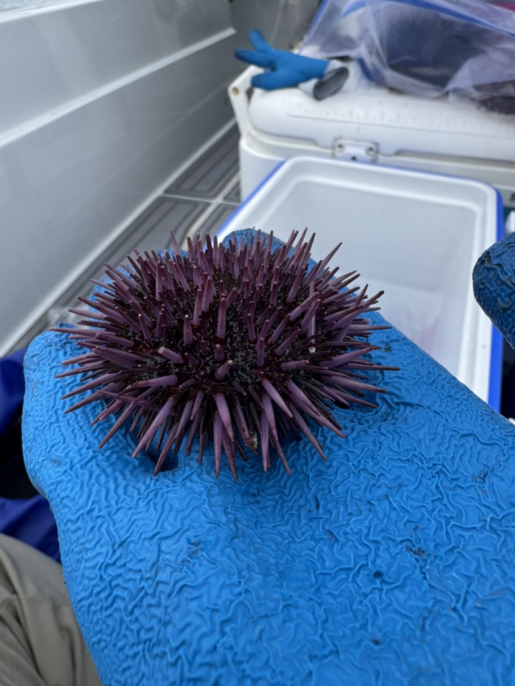
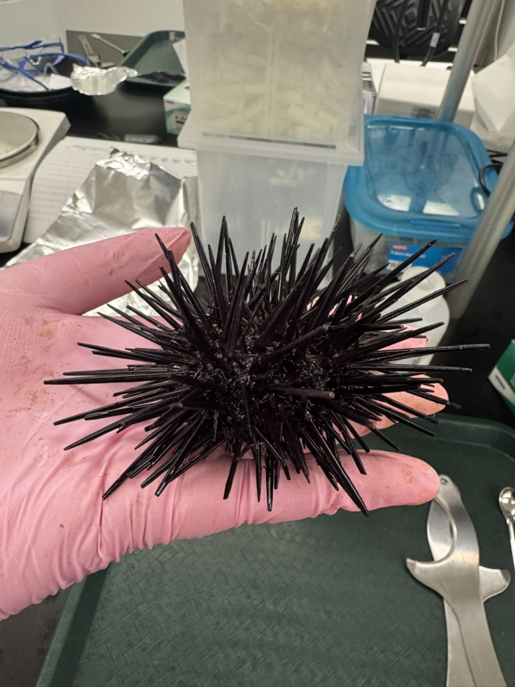
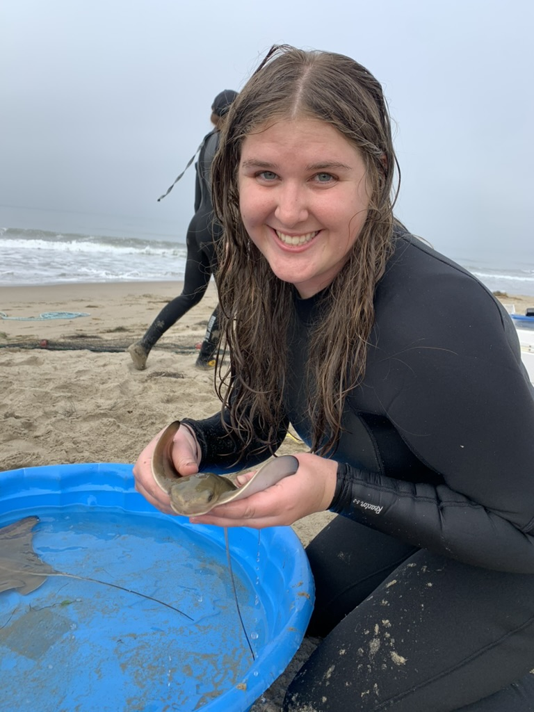

My current research focuses on quantifying pesticide concentrations in the gonads of sea urchins along the Southern California coast. Two species are commonly harvested in the area: the red sea urchin and the purple sea urchin (pictured below).

{fig-align="left" width="218"}

{fig-align="left" width="220"}

The red sea urchin is the primary commercial species due to its larger size and higher yield of gonad. The purple sea urchin, represents a promising alternative. Its population has increased substantially in recent years, contributing to widespread overgrazing of kelp forests and the formation of “urchin barrens”, where food resources become scarce. Utilizing purple urchins may offer both ecological and economic benefits.

Despite being widely consumed, neither species has been thoroughly assessed for pesticide contamination in their edible tissues. This is notable given the documented presence of contaminants in the sediments where they reside, including legacy pesticides such as DDT (Schiff et al. 2016) as well as more recently used compounds like pyrethroids, fipronil, and organophosphates (Holmes et al. 2008; Delgado-Moreno et al. 2011; Taylor et al. 2019).

Pesticide accumulation has also been observed in higher trophic-level organisms, including fishes and marine mammals (Southern California Bight 2018; Mackintosh et al. 2016), highlighting the potential for transfer through the food web.

We know these pesticides can have toxic effects on sea urchins, as they model species of toxicology (Bresch and Arendt 1977, Bellas et al. 2005, Erkmen 2015, Parra-Luna et al. 2020).

Previous Research

{width="183"}

Elasmobranchs are another understudied fished species in southern California. We quantified organochlorine contaminants (DDXs and PCBs) in the muscle and live tissues of three species of elasmobranch (Angel Shark, Leopard Shark, and Bat Ray) that are fished in California for subsistence or commercial fishing.
