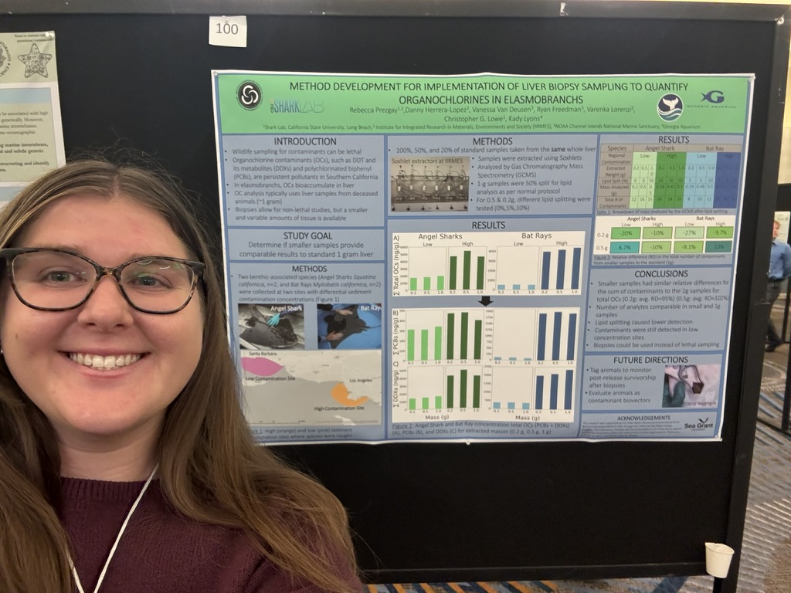

**Publications**

1.  Rex, P.T., Abbott, K.J., **Prezgay, R.E.**, Lowe, C.G. 2024. The Effects of Depth and Altitude on Image-Based Shark Size Measurements Using UAV Surveillance. Drones~~,~~ 8, 547. https://doi.org/10.3390/ drones8100547
2.  Paper in prep
3.  Paper in prep
4.  Paper in prep

**Presentations**

1.  (Poster) **Rebecca Prezgay**, Varenka Lorenzi, Jeremy T. Claisse, Andrea Bonisoli-Alquati. Exposure to Legacy and Current Use Pesticides in Sea Urchins of Aquaculture and Fisheries Interest – SoCal SETAC 2026. San Pedro, California. April 26-27, 2026.
2.  (Poster) Victoria Gronwald and **Rebecca Prezgay.** The Secret Lives of Panamanian Stingrays - College of Science Symposium 2026. Pomona, California. April 24, 2026.
3.  (Poster) **Rebecca Prezgay**, Varenka Lorenzi, Jeremy T. Claisse, Andrea Bonisoli-Alquati. Exposure to Legacy and Current Use Pesticides in Sea Urchins of Aquaculture and Fisheries Interest– College of Science Symposium 2026. Pomona, California. April 24, 2026.
4.  (Presentation) **Rebecca Prezgay**, Jeremy T. Claisse, Andrea Bonisoli-Alquati. Exposure to Current-Use and Legacy Pesticides in Sea Urchins - Agriculture Research Institute (ARI) Next-Gen. 2025-2026 Workshop Four. April 17, 2026, via Zoom.
5.  (Presentation) **Rebecca Prezgay**, Jeremy T. Claisse, Andrea Bonisoli-Alquati. Exposure to Current-Use and Legacy Pesticides in Sea Urchin. Agriculture Research Institute (ARI) Next-Gen 2025-2026 Workshop Three. February 6, 2026, via Zoom.
6.  (Presentation) **Rebecca Prezgay**, Jeremy T. Claisse, Andrea Bonisoli-Alquati. Exposure to Legacy and Current Use Pesticides in Marine Invertebrate and Kelp Species of Aquaculture and Fisheries Interest The Southern California Regional Chapter of the Society of Environmental Toxicology and Chemistry (SoCal SETAC) 2026 Winter Dinner Meeting Presentations. January 27, 2026, Santa Monica, CA.
7.  (Poster) **Rebecca Prezgay**, Luci Herrera-Lopez, Vanessa VanDeuson, Ryan Freedman, Christopher G. Lowe, Kady Lyons, Varenka Lorenzi. Implementation of Liver Biopsies to Quantify Organochlorine Contaminants in Elasmobranchs – SoCal SETAC 2025. San Diego, California. April 28-29, 2025.
8.  (Presentation) **Rebecca Prezgay**. Ocean Contaminants and Safe Fish Consumption. Coffee and Conversations with OC Habitats. December 4, 2024.
9.  (Poster) **Rebecca Prezgay**, Luci Herrera-Lopez, Vanessa VanDeuson, Ryan Freedman, Varenka Lorenzi, Kady Lyons, Christopher G. Lowe. Method Development for Implementation of Liver Biopsy Sampling to Quantify Organochlorines in Elasmobranchs – Western Society of Naturalists 2024. Portland, Oregon. November 7-10, 2024.

{width="354"}
